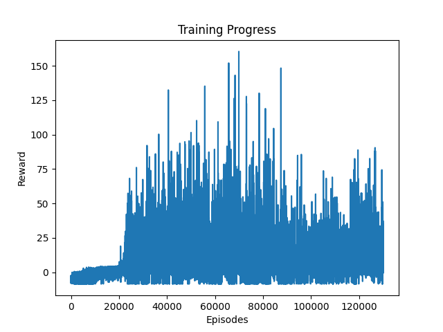
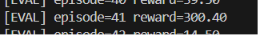

<h1 align="center">🐦 Flappy Bird AI</h1>
<h3 align="center">Deep Reinforcement Learning using Deep Q-Network (DQN)</h3>

<p align="center">
  
  
  
  
</p>

---

## 🎮 Gameplay Demo

<p align="center">
  https://github.com/user-attachments/assets/472e2a60-5bff-4984-a2d6-89f4ed2ef734
</p>

<p align="center"><i>Agent autonomously learning to navigate through pipes</i></p>

---

## 📊 Training Progress

<p align="center">
  
</p>

<p align="center"><i>Reward vs Episodes showing learning curve and performance improvement</i></p>

---

## 🎯 Evaluation Result

<p align="center">
  
</p>

<p align="center"><i>High-score evaluation run demonstrating trained policy</i></p>

---

## 🚀 Overview

This project implements a **Deep Reinforcement Learning agent** that learns to play Flappy Bird using a **Deep Q-Network (DQN)**.

The agent:

* Learns from environment interaction
* Improves using reward signals
* Approximates Q-values using neural networks

---

## 🧠 Key Concepts

* Deep Q-Network (DQN)
* Experience Replay
* Epsilon-Greedy Exploration
* Reward Shaping

---

## ⚙️ Learning Pipeline

```
State → Neural Network → Q-values → Action
             ↑
     Experience Replay Buffer
```

---

## 🎯 Reward Function

| Event     | Reward |
| --------- | ------ |
| Pass Pipe | +1     |
| Survival  | +0.1   |
| Collision | -5     |

---

## 📈 Results

| Metric            | Value    |
| ----------------- | -------- |
| Training Episodes | 120,000+ |
| Peak Reward       | 150+     |
| Evaluation Reward | 300+     |
| Pipes Crossed     | ~50–100  |

---

## 📂 Project Structure

```
Flappy_bird/
│
├── agent.py
├── dqn.py
├── experience_replay.py
├── parameters.yaml
│
├── assets/
│   ├── gameplay.mp4
│   ├── training_plot.png
│   ├── final_eval.png
│
├── runs/
└── README.md
```

---

## ⚠️ Limitations

* Instability in vanilla DQN
* Performance oscillation at high rewards

---

## 🚀 Future Improvements

* Double DQN
* Dueling DQN
* Prioritized Experience Replay

---

## 👨‍💻 Author

**Abhay Kumar**

---

<p align="center">⭐ Star this repo if you like it!</p>


